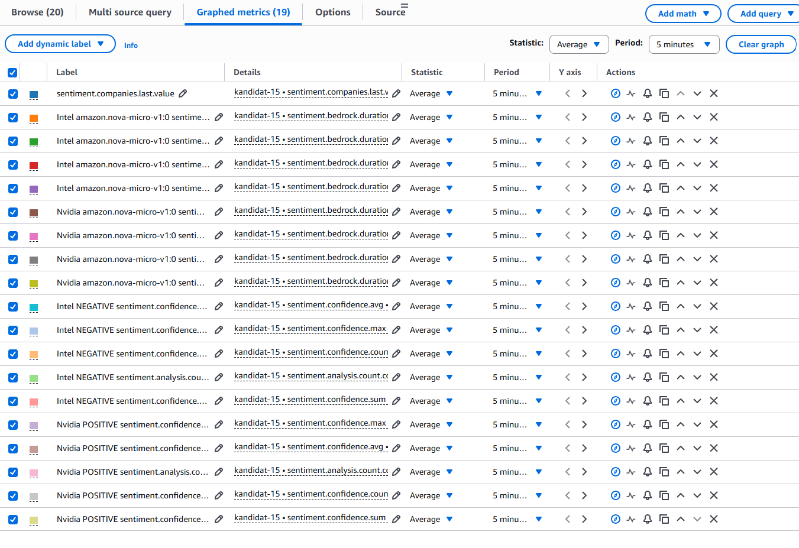
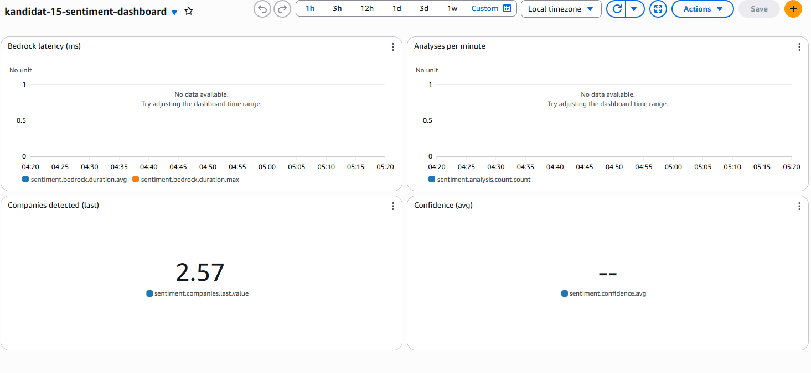
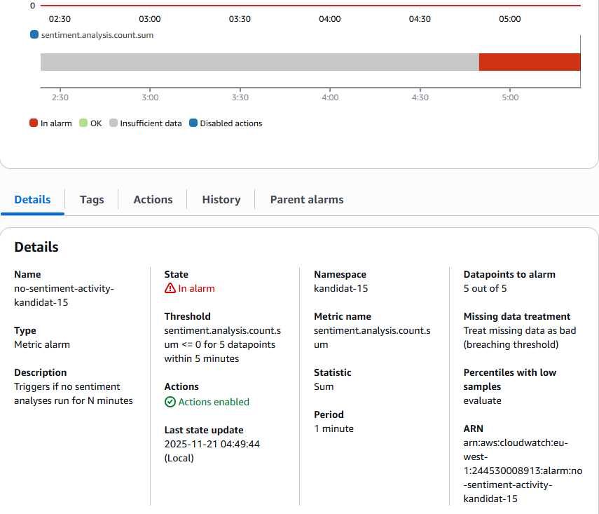
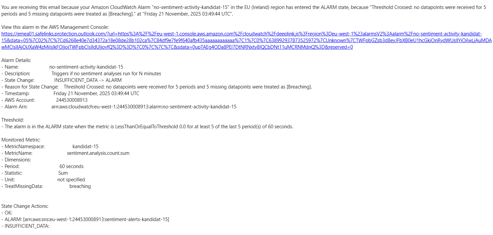

# PGR301 Eksamen 2025 - Besvarelse

Kandidatnummer: 15

---

### Oppgave 1 - Terraform, S3 og Infrastruktur som Kode
#### Leveranser
**Terraform-kode**
- mappe: infra-s3/
- hovedfiler:
    - main.tf
    - variables.tf
    - outputs.tf

**GitHub Ations Workflow**
- Workflow-fil: ./github/workflows/terraform-s3.yml
- Workflow kjøring: https://github.com/Jajijanne/kandidat-15-pgr301-eksamen-2025/actions/runs/19549271912

**S3 Bucket**
- Bucket navn: kandidat-15-data
- Region: eu-west-1

---

### Oppgave 2 Del 1
Jeg måtte legge til 

    Api:
        EndpointConfiguration: REGIONAL

under Globals i template.yaml da jeg fikk error om at det ikke var mulig å opprette flere API Gateway-EDGE endepunkter, og at grensen der var nådd.

#### Leveranser
- Her er url fra sam: https://mqh1pdmm9g.execute-api.eu-west-1.amazonaws.com/Prod/analyze/
- Her er s3 object: s3://kandidat-15-data/midlertidig/comprehend-20251120-215128-d54698db.json

### Oppgave 2 Del 2
#### Leveranser
- Workflow-fil: .github/workflows/sam-deploy.yml
- Successful deploy: https://github.com/Jajijanne/kandidat-15-pgr301-eksamen-2025/actions/runs/19553359377
- PR validation: https://github.com/Jajijanne/kandidat-15-pgr301-eksamen-2025/actions/runs/19553468113

For å kunne kjøre workflowen må du forke repositoriet. Deretter legge inn github secrets AWS_ACCESS_KEY_ID og AWS_SECRET_ACCESS_KEY. 

Hvis du vil deploye til aws trenger du bare å gjøre en endring på main og deretter pushe. Da vil workflowen kjøre sam validate, build og deploy.

Hvis du ikke vil deploye kan du lage en ny branch og gjøre endringer (kan være en liten kommentar et sted) der og deretter pushe til den branchen du nettopp lagde. Da vil kun sam validate og build kjøre.

---

### Oppgave 3 Del 1
#### Leveranse
Fungerende Dockerfil: sentiment-docker/Dockerfile

### Oppgave 3 Del 2
#### Leveranser
- Workflow fil: ./github/workflows/docker-build.yml
- Successful build: https://github.com/Jajijanne/kandidat-15-pgr301-eksamen-2025/actions/runs/19555107851
- Container image: jajijanne/sentiment-docker:latest
#### Instruksjoner til sensor
1. Opprett Docker Hub konto og access token
2. Legg til GitHub Secrets: DOCKER_USERNAME og DOCKER_TOKEN
3. Push en endring i sentiment-docker til main for å trigge workflow
4. Sjekk github actions

---

### Oppgave 4 Del 1
Screenshot av CloudWatch Metrics-konsoll som viser **noen** implementerte custom metrics

Jeg har implementert følgende metrikker i SentimentMetrics.java :
1. **Timer:** måler hvor lang tid analysene tar per selskap og modell
2. **DistributionSummary:** samler statestikk rundt confidence-scores
3. **Counter:** teller antall analyser per selskap og sentimenttype
4. **Gauge:** viser antall selskaper oppdaget i siste analys

### Oppgave 4 Del 2
#### Leveranser
- Terraform kode: infra-cloudwatch/

- Dashbord Screenshot:

- Alarm Screenshot: 

- E-post Screenshot:

---

### Oppgave 5 - Refleksjon om KI og DevOps-prinsipper
 KI har blitt en naturlig del av både utvikling og DevOps-arbeid, enten man liker det eller ikke. Værktøy som ChatGPT, Copilot og andre assistenter dukker opp overalt, og det er umulig å ignorere hvor mye de faktisk påvirker måten vi jobber på. For meg har KI gjort utvikling raskere og enklere. Når jeg tenker på det gjennom DevOps-prinsippene **Flyt, Feedback og Kontinuerlig læring**, ser jeg ganske tydelig hvordan KI både kan løfte team og samtidig skape nye utfordringer.

#### **Flyt**
Det mest åpenbare KI bidrar med er bedre flyt. Oppgaver som før var litt kjedelige og repetitive, som å skrive boilerplate-kode, finne riktig API-syntaks eller bygge strukturen til en funksjon, går plutselig ekstremt fort. Det gir en følelse av fremdrift. Ting som tok en time eller mer, kan nå løses på sekunder med et godt prompt. 
Men dette har også en bakside. Når jeg bruker KI mye, merker jeg at det er lett å "overlate" litt for mye til KI. Koden ser kanskje bra ut med en gang, men det er ikke sikkert jeg egentlig forstår den. Det betyr at flyten kan bli dårligere senere i prosessen, for eksempel når noe feiler i testen eller når jeg skal debugge. Da oppdager jeg plutselig at jeg ikke helt vet hvorfor koden ble skrevet slik den bel. Det gjør feilsøking tregere, og dermed påvirkes flyten negativt. Med andre ord gir KI bedre flyt i starten, men kan skape problemer etterpå hvis man ikke er bevvist på hva man limer inn.

#### **Feedback**
DevOps er avhengig av gode feedback-looper. Testing, bygging, feilmeldinger og overvåking gir signaler hele veien, og det som gjør DevOps effektivt er at vi forstår signalene raskt. Her kan KI være både en fantastisk støtte og et hinder.
På den positive siden kan KI hjelpe meg å analysere feilmeldinger og foreslå hvor problemet ligger. Den kan peke på feil konfigurasjon, foreslå hva som mangler, og hjelpe meg å finne røde flagg i logs. Jeg har flere ganger fått gode hint fra KI som jeg ikke ville tenkt på selv.
Men den andre siden er like viktig. Når koden er generert av KI, har jeg ofte ikke den samme forståelsen av strukturen. Når en test feiler, blir det vanskeligere å se hvorfor. Det er ikke alltid nok å få en forklaring fra KI. Noen ganger må jeg faktisk forstå sammenhengen selv for å fikse problemet riktig. Det gjør at feedback-loopene blir tregere når jeg jobber med kode jeg selv ikke har full kontroll på. 
Derfor blir god observability, gode logger og gode tester enda viktigere når KI er en del av utviklingen. 

#### **Kontinuerlig læring**
Det tredje DevOps-prinsippet handler om læring, forbedring, kunnskapsdeling og eksperimentering. Her merker jeg at KI kan være en stor fordel. Jeg lærer fortere når jeg får gode forklaringer, konkrete eksempler og forslag til løsninger. KI gjør det lettere å forstå nye teknologier, skrive bedre prompts og utforske forskjellige måter å løse problemer på. 
Det finnes også en risiko med dette. Jeg lærer mindre i dybden når KI gjør mye av jobben. Hvis jeg bruker KI til alt begynner jeg å miste noe av den kompetansen jeg egentlig trenger for å jobbe godt i et DevOps-team. DevOps krever at man forstår:
- hvorfor ting fungerer
- hvordan pipelines er satt opp
- hvordan systemer henger sammen
- og hva som skjer når noe går galt

Hvis KI gjør alt det tunge arbeidet, kan jeg bli mer passiv, og da mister jeg den dype kunnskapen som gir trygghet i drift. Så KI kan enten være en fantastisk mentor, eller noe som sakte fjerner kompetansen jeg trenger.

#### **Oppsummering**
Min opplevelse er at KI påvirker alle DevOps-prinsippene på godt og vondt:
- **Flyt:** KI gjør utvikling raskere, men kan skape problemer senere hvis man ikke forstår koden.
- **Feedback:** KI kan hjelpe å analysere problemer, men generert kode gjør feil og kan være vanskeligere å tolke.
- **Kontinuerlig læring:** KI kan hjelpe oss å lære raskere, men også gjøre oss passive hvis vi bruker det blindt.

Jeg tror nøkkelen er balanse. KI må brukes som et verktøy, og ikke som er erstatning for forståelse. Brukt riktig kan det være en enorm styrke for DevOps-team, med raske leveranser, bedre kvalitet og mer læring. Brukt feil kan det skape uklar kode og svake feedback-looper.
Så for meg handler det om å bruke KI smart. Ta imot hjelpen, men alltid forstå det jeg sender videre inn i pipeline.

